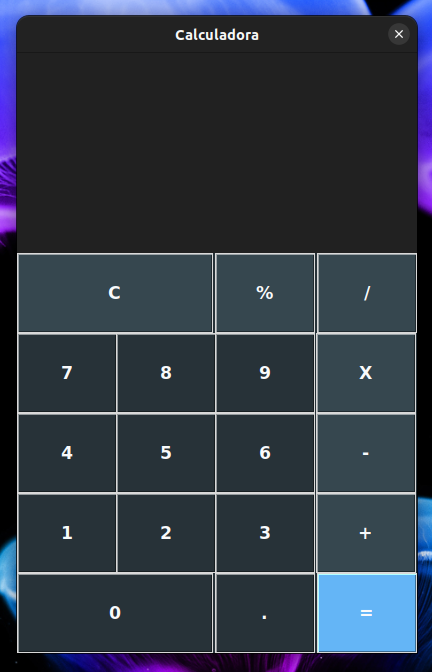

  <h1>🐍 Calculadora Simples 🐍</h1>

A calculadora presente neste repositório foi construída com Python – utilizando a biblioteca padrão e baseada em Tcl/Tk: Tkinter. Este aplicativo foi desenvolvido no início do meu processo de aprendizagem da linguagem Python.

 
 

  

